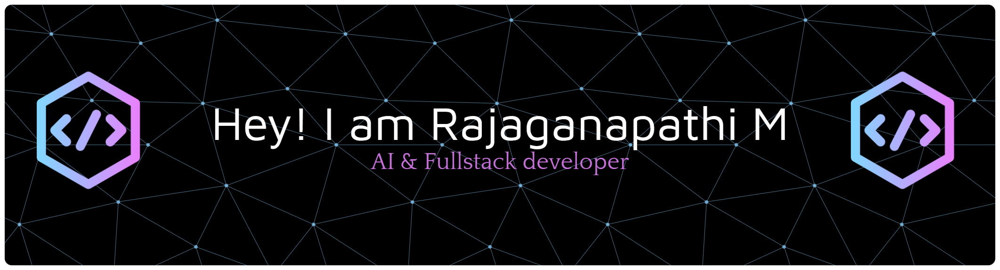

# Hi 👋, I'm Raja Ganapathi  

### A Tech Enthusiast from India 🇮🇳  

- 👨‍💻 Passionate about **DSA, Full Stack Development & AI**
- 🎓 Computer Science Student  
- 🚀 Consistently improving problem-solving skills  
- 📚 Currently focused on **DSA & System Design**  
- 🧠 Solved **1800+ problems** across multiple coding platforms  
- ⭐ **2★ CodeChef Coder**
- pupil in codeforces (1399)

---

##

## 🔥 Coding Activity

### 📌 Codolio

> 🔹 Track total problems solved across platforms on Codolio

### 🧠 LeetCode

---

## 🛠️ Tech Stack
&nbsp; <b>Skills</b>

<table align="center">
  <tr>
    <td align="center" width="180">
      <strong>Languages</strong>
    </td>
    <td>
      
      
      
      
      
      
    </td>
  </tr>

  <tr>
    <td align="center">
      <strong>Frontend</strong>
    </td>
    <td>
      
      
      
      
    </td>
  </tr>

  <tr>
    <td align="center">
      <strong>Backend & Databases</strong>
    </td>
    <td>
      
      
      
    </td>
  </tr>

  <tr>
    <td align="center">
      <strong>AI / ML</strong>
    </td>
    <td>
      
      
      
      
      
    </td>
  </tr>

  <tr>
    <td align="center">
      <strong>Tools & Platforms</strong>
    </td>
    <td>
      
      
      
      
      
    </td>
  </tr>
</table>

## 👀 Profile Views

  

